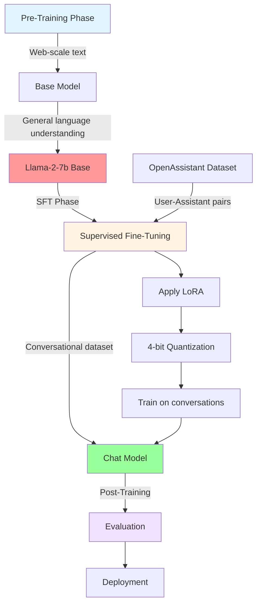
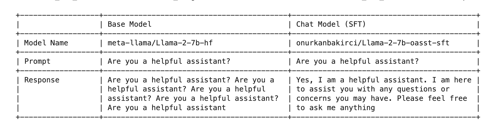
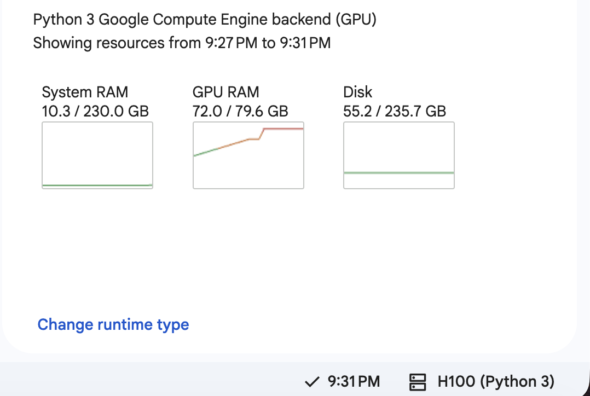

# Base to SFT

A minimal code example for Supervised Fine-Tuning (SFT) to convert a base language model into a conversational chat model.

## Overview

`sft.py` demonstrates how to fine-tune Meta's Llama-2-7b base model on the OpenAssistant dataset to create a helpful chat assistant using parameter-efficient training techniques.

## Training Pipeline



## Model Evolution

### Base vs Chat Model Comparison



## Quick Start

```bash
# Install dependencies
pip install torch transformers datasets peft trl bitsandbytes

# Run training
python sft.py
```

## What's Inside

- **Model Loading**: 4-bit quantized Llama-2-7b
- **LoRA**: Parameter-efficient fine-tuning
- **Dataset**: OpenAssistant conversational data
- **Training**: 2 epochs with cosine scheduler
- **Output**: Fine-tuned chat model

### GPU Usage During Training


